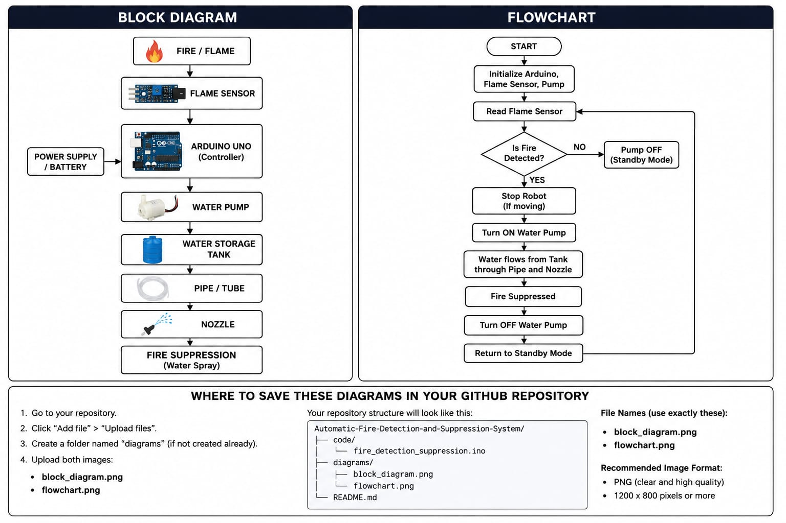
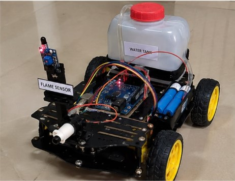
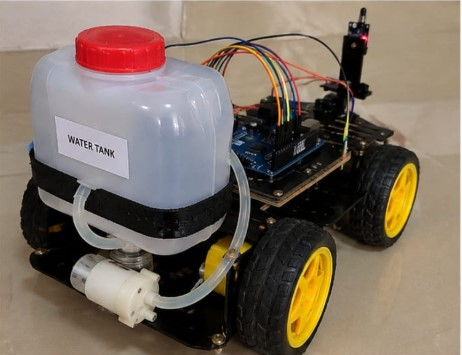
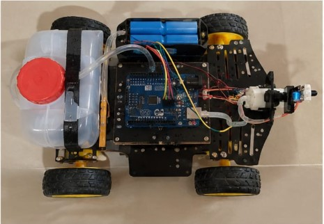
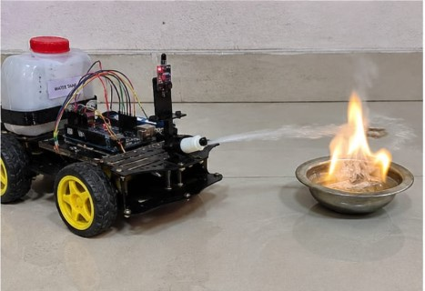

# Automatic Fire Detection and Suppression System

## Project Overview

The Automatic Fire Detection and Suppression System is an Arduino Uno-based robotic system designed to detect fire and automatically suppress it using water.

The system uses a flame sensor to detect the presence of fire. When a flame is detected, the Arduino Uno processes the sensor signal and activates the water-suppression mechanism. A water storage container mounted at the rear of the robotic vehicle supplies water through a pipe and nozzle to extinguish the detected fire.

This project was developed as a first-year engineering project to demonstrate the practical application of sensors, microcontrollers, robotics, and automation.

## Objectives

- To detect fire using a flame sensor.
- To develop an automatic fire detection system using Arduino Uno.
- To automatically activate a water-suppression mechanism when fire is detected.
- To integrate fire detection and suppression into a mobile robotic platform.
- To gain practical experience in Arduino programming and embedded systems.

## Components Used

| Component | Purpose |
|---|---|
| Arduino UNO | Main controller for processing the flame sensor signal |
| Flame Sensor | Detects the presence of flame/fire |
| Water Pump | Pumps water when fire is detected |
| Water Storage Tank | Stores water for fire suppression |
| Pipe/Tube | Carries water from the tank to the nozzle |
| Nozzle | Directs the water toward the detected fire |
| Power Supply/Battery | Provides power to the system |
| Connecting Wires | Electrical connections between components |

## Pin Configuration

| Component | Arduino UNO Pin | Function |
|---|---|---|
| Flame Sensor | D2 | Digital fire detection input |
| Water Pump Control | D8 | Pump activation output |

> **Note:** The water pump should be operated through an appropriate driver such as a relay module or transistor/MOSFET circuit rather than being powered directly from an Arduino GPIO pin.

## Hardware Connections

### Flame Sensor

Flame Sensor
     │
     ├── VCC → Arduino 5V
     ├── GND → Arduino GND
     └── DO  → Arduino D2

Water pump control 

Arduino UNO D8
      │
      ↓
Relay / Pump Driver
      │
      ↓
Water Pump
      │
      ↓
Water Storage Tank
      │
      ↓
Pipe / Nozzle

## Working Principle
1. The flame sensor continuously monitors the surrounding area for a flame.
2. The sensor sends a digital signal to the Arduino UNO.
3. When a flame is detected, the Arduino identifies the fire condition.
4. The Arduino activates the water-pump control output.
5. The pump supplies water from the storage tank through the pipe and nozzle.
6. Water is sprayed toward the fire for suppression.
7. After the suppression cycle, the pump is switched OFF.
8. The system returns to monitoring mode.

## Main Components

- Arduino Uno
- Flame Sensor
- Water Storage Container
- Water Pump
- Pipe/Tube
- Nozzle
- Robotic Vehicle/Chassis
- DC Motors
- Wheels
- Motor Driver
- Battery/Power Supply
- Connecting Wires

## System Architecture

text
             FIRE / FLAME
                  |
                  v
           +--------------+
           | Flame Sensor |
           +------+-------+
                  |
                  v
           +--------------+
           | Arduino UNO  |
           +------+-------+
                  |
                  v
           Fire Detection
                  |
                  v
           Water Pump ON
                  |
                  v
          Water Storage Tank
                  |
                  v
               Pipe
                  |
                  v
               Nozzle
                  |
                  v
          Fire Suppression

Hardware
The hardware consists of an Arduino Uno, flame-sensing unit, robotic vehicle, water storage system, water pump, pipe and nozzle mechanism.
The water storage system is mounted at the rear of the robotic vehicle. When fire is detected, the suppression mechanism delivers water toward the fire through the pipe and nozzle.

Software
The system is programmed using the Arduino IDE
The Arduino program reads the digital output of the flame sensor and controls the waterpump activation based on the detected condition

Key Features
Automatic flame detection
Arduino-based control
Automatic water-based fire suppression
Mobile robotic platform
Integrated water storage system
Sensor-based response

Learning Outcomes
Through this project, we gained practical experience in:
Arduino programming
Flame sensor interfacing
Embedded systems
Basic robotics
Motor control
Water pump control
Hardware integration
Troubleshooting and testing

Project Type
First-Year Engineering Project
Domain: Embedded Systems, Robotics and Automation
Microcontroller: Arduino Uno

Future Scope
The system can be further improved by adding:
Multiple flame sensors for wider detection
Automatic direction control toward the fire
Wireless monitoring
Temperature and smoke sensors
Improved water-pressure control
Remote monitoring and control

System Block Diagram and Flowchart

The following diagram illustrates the overall architecture and operating flow of the fire detection and suppression system.

## Project Gallery

The following images are illustrative visualizations of the proposed project setup and are included to demonstrate the system structure and component arrangement.

### Front View

### Rear View – Water Storage System

### Electronics and Components

### Water Pump and Suppression Mechanism

